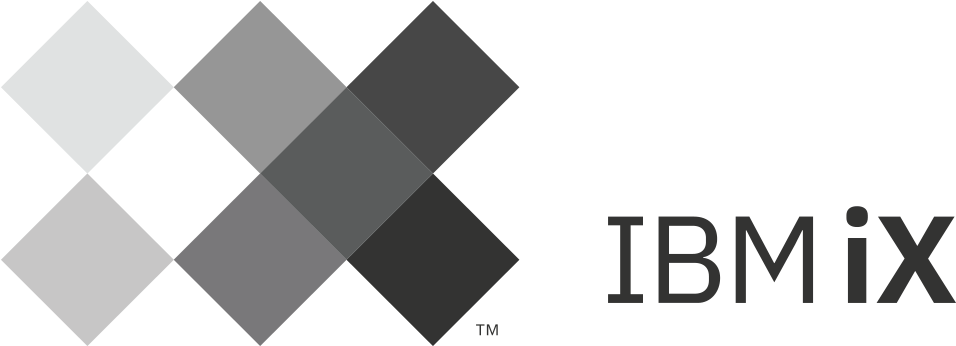

[](https://www.ibm.com/services/ibmix)

IBM iX - SAP Commerce Sonar Rules
=======
[](https://sonarcloud.io/summary/new_code?id=ibmix-sapcommerce-sonar-rules)

### Summary
Sonarqube Plugin containing custom rules and security hotspots for SAP Commerce development.

### Quality Profile
After plugin installation manually add rules you like to use to your quality profile.<br/>
See summary of custom rules: [Rule Summary](RULES.md)<br/>

### Compatibility
This plugin supports SonarQube versions starting from v9.9

### Build and test the plugin

Execute the build and get the jar from ./target/sapcx-java-roles-<version>.jar<br/>
Unittests require a local SAP Commerce installation. Path needs to be provided in the hybrisHome environment variable.
```
mvn clean install -DhybrisHome=path/to/hybris
```
If you do not have access to a SAP Commerce installation you can skip the tests
```
mvn clean install -DskipTests
```

### Installation
To manually install the plugin put it into respective folder of your sonarqube installation and restart
```
$SONARQUBE_HOME/extensions/plugins
```

### License
Copyright 2023-present IBM Corporation

All contents in this repository are licensed under the [Apache License, Version 2.0](LICENSE).
